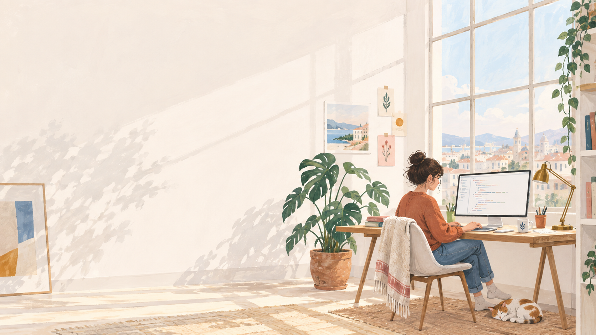
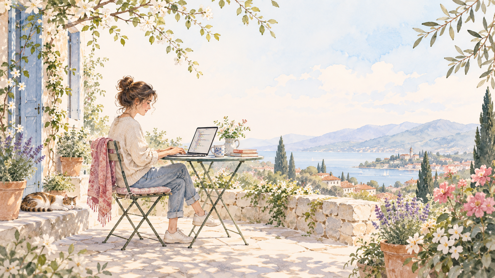
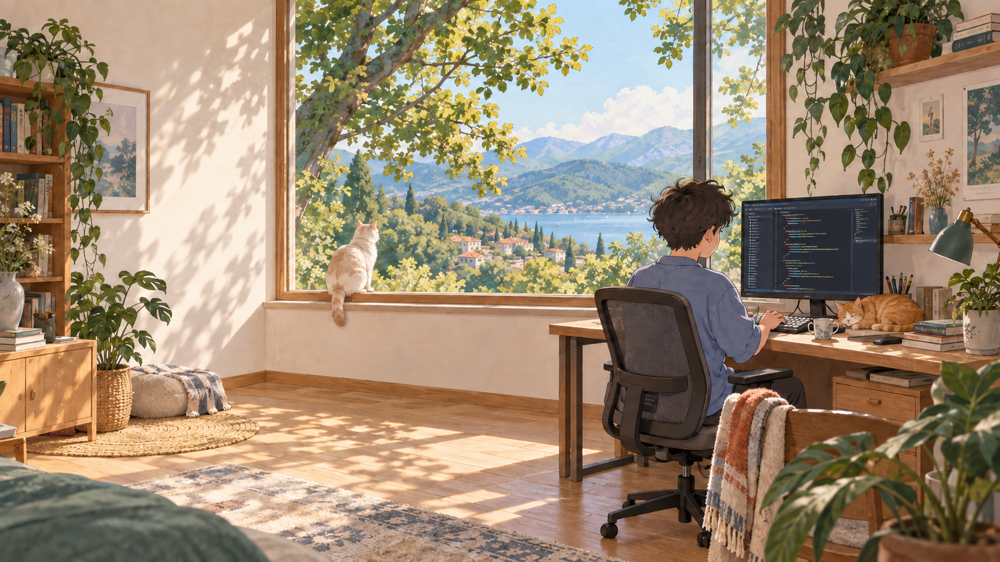
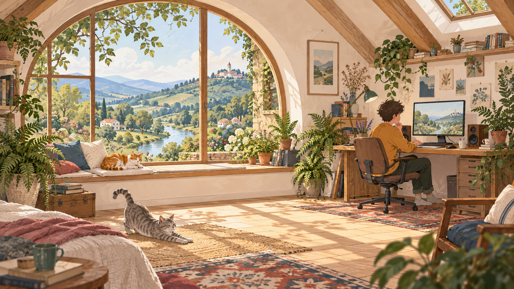

# Monokai Pro Light Sun for Omarchy

A warm, light [Omarchy](https://omarchy.org/) theme inspired by **Monokai Pro Light (Filter Sun)**. Cream surfaces, cool blue borders, and eight illustrated programming wallpapers make a calm daytime desktop.



## Features

- Warm cream background (`#F8EFE7`) and dark plum text (`#2C232E`).
- Consistent cool blue (`#2473B6`) window and shell borders, with translucent inactive-window borders.
- Softer selections, darker muted text, and thin menu outlines.
- Matching launcher, notification, tooltip, control, lock-screen, and wallpaper-picker borders. Authentication errors retain their semantic error colors.
- Sun terminal colors and a matching Chromium tint.
- Eight light illustrations featuring people, coding, computers, cats, and nature.

## Install

```bash
omarchy theme install https://github.com/sayaamirul/omarchy-monokai-pro-light-sun-theme.git
```

The installer applies the theme. To select it later:

```bash
omarchy theme set monokai-pro-light-sun
```

This version targets Omarchy's `colors.toml` theme generation, Lua Hyprland configuration, and Quickshell surfaces. Older releases may not support all styling options.

## Update

If your installed theme checkout has no local changes:

```bash
git -C ~/.config/omarchy/themes/monokai-pro-light-sun pull --ff-only
omarchy theme set monokai-pro-light-sun
```

Back up or commit personal edits first. Reinstalling with `omarchy theme install` replaces the existing theme directory.

## Wallpapers

The collection includes eight AI-generated illustrations, each a **1672 × 941 PNG**:

| File | Scene |
| --- | --- |
| `01-sunny-studio.png` | Programmer at a desktop computer in a sunlit studio |
| `02-top-down-laptop.png` | Overhead laptop desk with code and algorithm sketches |
| `03-garden-programmer.png` | Outdoor coding in a bright garden |
| `04-team-workshop.png` | Isometric team workspace with computers and a planning board |
| `05-minimal-coder.png` | Minimal geometric laptop-coding scene |
| `sunlit-computer-nook.png` | Boy coding at a sunlit computer desk with two cats and a mountain-view window |
| `sunlit-computer-nook-coding.png` | The same sunny computer nook, with a code editor on the monitor |
| `leafy-window-retreat.png` | Attic computer workspace with two cats and a garden-view window |

Open the picker with `omarchy theme bg-switcher`. After updating, reapply the theme and reopen the picker to refresh the active wallpaper collection. Personal additions can live in `~/.config/omarchy/backgrounds/monokai-pro-light-sun/`.

<details>
<summary>View more wallpaper previews</summary>








</details>

## VS Code

Install the official extension:

```bash
code --install-extension monokai.theme-monokai-pro-vscode
```

Run **Preferences: Color Theme** and select **Monokai Pro Light (Filter Sun)**, or set:

```json
"workbench.colorTheme": "Monokai Pro Light (Filter Sun)"
```

Current Omarchy ignores `vscode.json` and Lua files supplied by Git-installed themes and generates editor configurations from the palette. Applying the desktop theme may therefore select **Omarchy** in VS Code; select the official Sun filter afterward if preferred. Automatic filter selection requires a separate local `theme-set` hook and is not installed by this repository.

The official extension is installed separately and has its own licensing terms.

## Neovim

The bundled `neovim.lua` configures [monokai-pro.nvim](https://github.com/loctvl842/monokai-pro.nvim) with its `light` filter, an approximation of Sun. Current Omarchy ignores this Lua file in Git-installed themes. To use the plugin, review and merge the configuration into your own LazyVim setup, accounting for existing colorscheme overrides.

## Palette

| Role | Color |
| --- | --- |
| Background | `#F8EFE7` |
| Lower / deepest surface | `#EEE5DE` / `#D2C9C4` |
| Raised surface | `#FDF7F3` |
| Foreground | `#2C232E` |
| Muted text | `#72696D` |
| Selection | `#E4DBD5` |
| Blue / UI accent and borders | `#2473B6` |
| Rose | `#CE4770` |
| Orange | `#D4572B` |
| Ochre | `#B16803` |
| Green | `#218871` |
| Violet | `#6851A2` |

Sun's terminal mapping uses orange for ANSI blue and cool blue for ANSI cyan. This adaptation preserves that mapping while using cool blue for desktop focus accents.

## Customization

- `colors.toml`: palette and active/inactive window borders.
- `shell.toml`: shell borders and focus styling.
- `chromium.theme`: browser tint.
- `backgrounds/`: wallpaper collection.

After editing, run `omarchy theme set monokai-pro-light-sun`.

## Credits

This is an unofficial adaptation, not affiliated with or endorsed by [Monokai](https://monokai.pro/) or Omarchy. The core palette and terminal mapping were checked against the installed official Monokai Pro Light (Filter Sun) VS Code theme. Desktop contrast, selection, and focus styling are customized for Omarchy.

All eight wallpapers were generated with OpenAI image generation using light programming-workspace prompts and the Sun palette. They are illustrations, not photographs. Preview images show the wallpapers rather than desktop screenshots.
